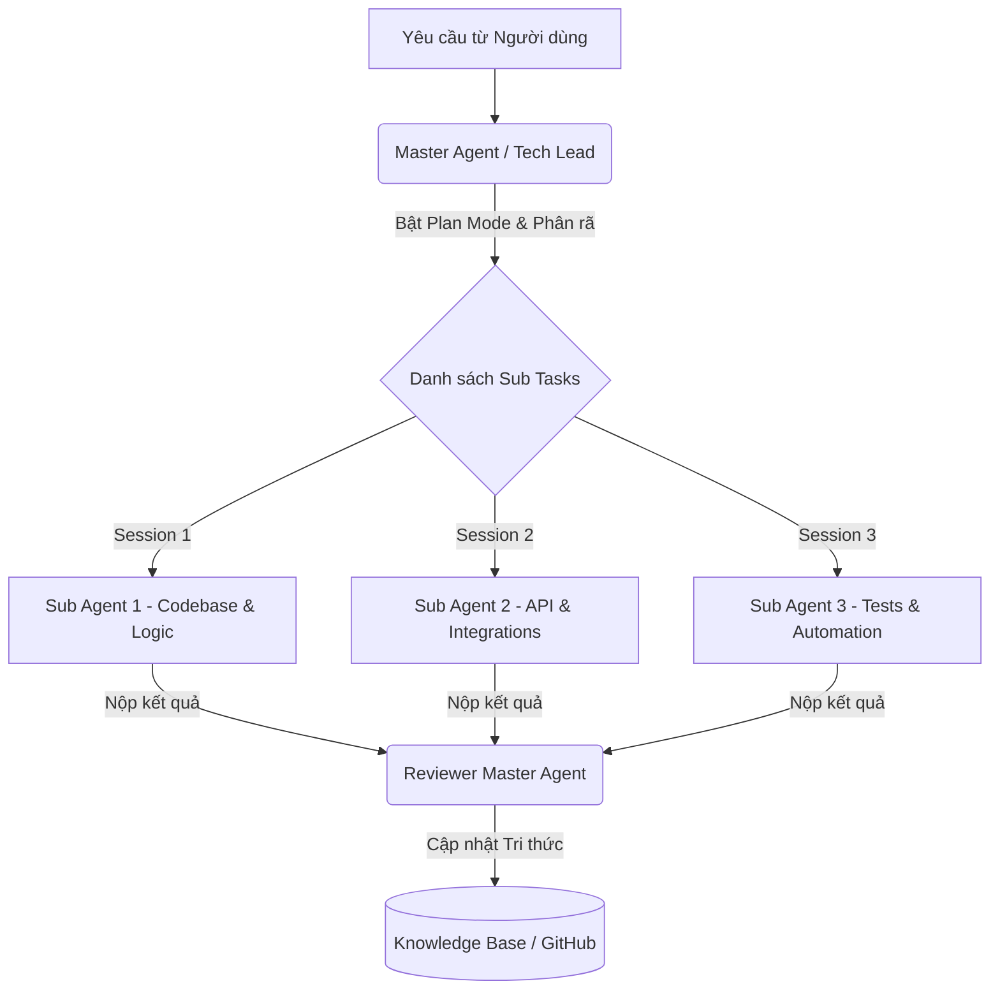

# CẨM NANG PHÁT TRIỂN PHẦN MỀM HIỆU QUẢ VỚI CLAUDE CODE
## (Áp dụng Mô hình Phân rã Master Agent - Sub Agent & Vibe Coding Thực Chiến)

---

## 1. TỔNG QUAN: HỆ SINH THÁI CLAUDE & SỰ DỊCH CHUYỂN TƯ DUY
Phần lớn người dùng hiện nay mới chỉ tiếp cận Claude như một chatbot hỏi đáp thông thường giống như ChatGPT, tức là mới chỉ khai thác chưa đầy **10% sức mạnh thực tế**. Để tối ưu hóa hiệu quả, lập trình viên cần hiểu rõ cấu trúc các sản phẩm chính của Anthropic:

*   **Claude Chat:** Công cụ hỏi đáp, tư vấn, phân tích dữ liệu, dịch thuật và thiết kế nhanh (qua tính năng Artifacts).
*   **Claude Cowork (Trợ lý văn phòng):** Tích hợp sâu thông qua các **Connectors** (Gmail, Google Calendar, Chrome) để tự động đọc email, quản lý lịch trình, cào dữ liệu web hoặc tự động điền và gửi biểu mẫu trực tiếp trên trình duyệt.
*   **Claude Code (Developer Agent CLI):** Công cụ dòng lệnh (CLI) chạy trực tiếp trong môi trường Terminal của dự án, có khả năng đọc/sửa mã nguồn, chạy lệnh shell, kiểm thử, tích hợp Git và tự động sửa lỗi.

> [!IMPORTANT]
> **Tư duy cốt lõi:** Không coi Claude là một chatbot hỏi đáp thụ động. Hãy quản lý Claude như **quản lý một đội ngũ kỹ sư phần mềm thực thụ** thông qua mô hình phân quyền **Master Agent - Sub Agent**.

---

## 2. KIẾN TRÚC MÔ HÌNH MASTER AGENT - SUB AGENT
Mô hình này mô phỏng chính xác cơ cấu hoạt động của một phòng phát triển phần mềm trong doanh nghiệp:



### Các vai trò trong mô hình:
1.  **Master Agent (Tech Lead / Project Manager):** Chịu trách nhiệm bao quát toàn bộ dự án, nhận yêu cầu (Requirements), nghiên cứu kiến trúc, lập kế hoạch chi tiết (Plan Mode), phân chia nhiệm vụ và kiểm duyệt chất lượng đầu ra (Code Review).
2.  **Sub Agent (Kỹ sư chuyên trách):** Mỗi Sub Agent hoạt động trong một session riêng biệt, chỉ tập trung xử lý một nhiệm vụ cụ thể (ví dụ: chỉ viết Regex, chỉ viết Dockerfile, hoặc chỉ sinh unit test).
3.  **Knowledge Base (Tài liệu dự án):** Hệ thống tài liệu đóng vai trò là "xương sống", lưu giữ tri thức tích lũy của dự án để onboard các Agent và nhân viên mới một cách nhanh chóng.

---

## 3. QUY TRÌNH 3 BƯỚC PHÁT TRIỂN PHẦN MỀM CHUẨN

### BƯỚC 1: ONBOARDING CONTEXT & LẬP KẾ HOẠCH (PLAN MODE)

#### A. Cung cấp bối cảnh (Context) đầy đủ
Trước khi bắt tay vào code, Master Agent cần được cung cấp đầy đủ thông tin dự án để giảm thiểu tối đa sai sót:
*   Mô tả yêu cầu chi tiết (Requirements).
*   Kiến trúc hệ thống, Coding Convention và các ràng buộc kỹ thuật.
*   Tài liệu thiết kế cơ sở dữ liệu hoặc API hiện tại.
*   Mã nguồn hoặc dự án mẫu để tham chiếu.

#### B. Áp dụng tư duy "WHY" trước "WHAT"
Khi yêu cầu AI, không chỉ đưa ra câu lệnh đơn giản dạng *"Viết OCR Parser"*. Hãy giải thích:
*   **Tại sao** cần parser này và hệ thống đích hoạt động ra sao?
*   Đầu ra (Output) mong muốn có cấu trúc thế nào?
*   Những giới hạn về hiệu năng, tốc độ hay tính bảo mật là gì?
*   Khi hiểu được động cơ đằng sau, Claude sẽ đề xuất giải pháp kiến trúc tối ưu hơn nhiều so với việc chỉ làm đúng theo mô tả kỹ thuật thô.

#### C. Kích hoạt Plan Mode & Chọn Model phù hợp
Sử dụng Plan Mode để Claude phân tích bài toán, thiết lập các phụ thuộc (dependencies) và ước lượng thứ tự thực hiện. Đồng thời, phân bổ model hợp lý để tiết kiệm tài nguyên:
*   **Claude Opus:** Dành cho các tác vụ khó (thiết kế kiến trúc, giải quyết bug logic phức tạp, nghiên cứu giải pháp, lập kế hoạch dài hạn).
*   **Claude Sonnet:** Dành cho các tác vụ chuẩn hóa (implement code theo mẫu, refactor code, viết tài liệu README, viết Unit Test).

---

### BƯỚC 2: THỰC THI CHUYÊN BIỆT VỚI CÁC SUB AGENT
Sau khi Master Agent chốt kế hoạch, các nhiệm vụ sẽ được chuyển giao cho từng Sub Agent chạy độc lập trong các session hoặc môi trường terminal riêng biệt.

*   **Tối ưu hóa Context:** Nhờ chia nhỏ công việc, mỗi Sub Agent chỉ nhận lượng context vừa đủ. Điều này giúp AI phản hồi cực nhanh, chính xác hơn, tránh bị loãng thông tin và tiết kiệm đáng kể chi phí token.
*   **Làm việc song song:** Các Sub Agent xử lý các module độc lập có thể chạy song song cùng lúc, tăng tốc độ hoàn thiện dự án.

---

### BƯỚC 3: CODE REVIEW & CẬP NHẬT TRI THỨC

#### A. Review chất lượng đầu ra
Khi các Sub Agent hoàn thành code, toàn bộ kết quả được đưa lại cho Master Agent để kiểm thử tổng thể.
*   Master Agent sẽ đối chiếu xem code đã đáp ứng đúng requirements ban đầu chưa, có xảy ra xung đột hay phá vỡ cấu trúc chung hay không.
*   Nếu phát hiện lỗi, Master Agent sẽ chỉ ra điểm sai và yêu cầu **đúng Sub Agent chuyên trách** sửa lại trong session của nó, tuyệt đối không sửa trực tiếp mã nguồn hỗn độn tại Master Agent.

#### B. Báo cáo thay đổi minh bạch
Yêu cầu các Agent luôn giải trình công việc theo cấu trúc chuẩn:
1.  **Đã thay đổi những gì?** (What changed)
2.  **Tại sao lại thay đổi?** (Why)
3.  **Tác động đến các module khác thế nào?** (Impact)
4.  **Các giả định kỹ thuật và rủi ro tiềm ẩn?** (Risks & Assumptions)

---

## 4. VÍ DỤ THỰC CHIẾN: VIBE CODING VỚI CLAUDE CODE VÀ ODOO.SH
Quy trình xây dựng tự động một module tiếp nhận học viên (Onboarding) tích hợp AI Helpdesk và gửi email tự động:

### Quy trình Setup môi trường:
1.  Liên kết tài khoản GitHub với nền tảng cloud (ví dụ: Odoo.sh hoặc môi trường VPS của bạn).
2.  Mở Terminal trực tiếp trên server/môi trường dev, gọi công cụ `claude` (Claude Code CLI) và đăng nhập bằng tài khoản Anthropic.
3.  Áp dụng **Prompt cấu trúc 5 bước** bằng tiếng Anh để khởi tạo:

```
[Prompt 5 bước chuẩn]
- Context: Spring Boot / Python / Odoo 19 framework, GitHub repository link.
- Requirement: Create onboarding module, send HTML mail with secure token, log clicks.
- Expected Output: Python models, XML views, automatic mail action on order confirm.
- Constraints: No third-party analytical JS, use GPT-4o mini API for auto-drafting FAQ responses.
- Reference: Existing sale order module, FAQ database.
```

### Quá trình Code tự động:
*   Claude Code tự động quét cấu trúc thư mục dự án, sinh logic backend (Python), tạo giao diện (XML), tự thiết kế cấu trúc database tương thích.
*   **Auto-generated Tests & Mock Data:** Chỉ với một câu lệnh đơn giản: *"Tạo dữ liệu giả lập học viên và kịch bản test tự động cho luồng mua hàng"*, Claude sẽ tự tạo toàn bộ tệp data mẫu và các test cases.
*   **Quản lý lịch sử và Git:** Mọi thay đổi về code đều được Claude Code đóng gói (package), tạo commit có thông điệp rõ ràng và tự động push lên nhánh Git tương ứng. Lập trình viên dễ dàng theo dõi lại lịch sử qua Git History để khôi phục khi cần.

---

## 5. QUẢN LÝ TRI THỨC (KNOWLEDGE BASE) & TASK PHÁT SINH

### Tri thức dự án là tài sản vô giá
Sau mỗi tính năng được hoàn thành hoặc mỗi lần sửa bug thành công, AI phải có trách nhiệm cập nhật lại tài liệu dự án trong thư mục `docs/` hoặc `knowledge/` (ví dụ: `architecture.md`, `api_specs.md`, `troubleshooting.md`).
*   **Lợi ích:** Giúp các Sub Agent chạy sau thừa hưởng ngay lập tức các quy tắc và bài học kinh nghiệm trước đó mà không cần giải thích lại, đồng thời giúp việc onboard nhân viên mới ngoài đời thực diễn ra nhanh chóng.

### Kiểm soát các yêu cầu phát sinh (Adhoc Tasks)
Trong quá trình code, nếu có yêu cầu đột xuất từ khách hàng hoặc cấp trên (ví dụ: đang làm OCR đột ngột cần thêm tính năng Export Excel):
*   **Giải pháp:** Tạo ngay một session phụ độc lập để giải quyết task adhoc đó. Sau khi hoàn thành và kiểm thử chạy ổn định, mới trích xuất các tri thức/quy tắc liên quan để cập nhật vào Knowledge Base chung, tránh làm gián đoạn hoặc gây nhiễu luồng logic chính của Master Agent.

---

## 6. KẾT LUẬN: TƯƠNG LAI CỦA GIAO TIẾP MÁY TÍNH
Cách chúng ta tương tác với máy tính và lập trình đang dịch chuyển từ việc tự tay click từng nút bấm, viết từng dòng code (Manual coding) sang vai trò của **người điều phối Agent (Agent Orchestrator)**. 

Bằng việc làm chủ **Claude Code**, vận dụng linh hoạt cấu trúc **5 thành phần AI Agent** (Instruction, Context, Memory, Tools/Connector, Skill), bạn sẽ nâng cao năng suất lập trình lên gấp nhiều lần, biến những ý tưởng phức tạp thành các sản phẩm phần mềm hoàn chỉnh chạy ổn định chỉ trong vài phút.
