# 🏗️ FIS AI Delivery — Kiến Trúc Luồng Hoạt Động End-to-End

## Mục Lục

1. [Tổng Quan Hệ Thống](#1-tổng-quan-hệ-thống)
2. [Luồng SDLC Pipeline](#2-luồng-sdlc-pipeline)
3. [Role 1: BA — Business Analyst](#3-role-1-ba--business-analyst)
4. [Role 2: SA — Solutions Architect](#4-role-2-sa--solutions-architect)
5. [Role 3: DEV — Development](#5-role-3-dev--development)
6. [Role 4: QA — Quality Assurance](#6-role-4-qa--quality-assurance)
7. [Role 5: DevOps — SRE](#7-role-5-devops--sre)
8. [Role 6: PM — Project Manager](#8-role-6-pm--project-manager)
9. [Hooks Lifecycle](#9-hooks-lifecycle)
10. [Rules Engine](#10-rules-engine)
11. [Handoff & Escalation](#11-handoff--escalation)

---

## 1. Tổng Quan Hệ Thống

### System Model — Luồng xử lý tổng quát

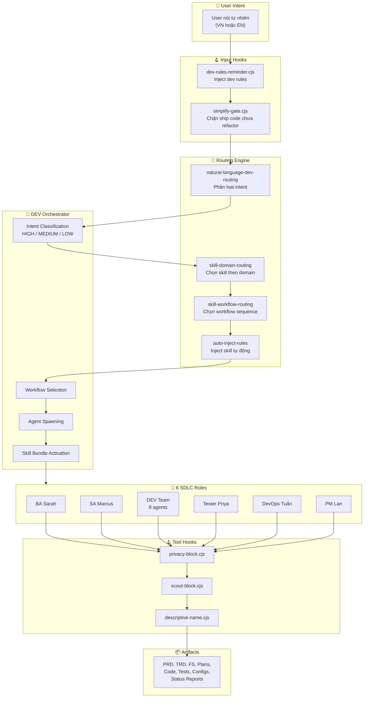

### Core Layers

| Layer | Đường dẫn | Vai trò | Số lượng |
|-------|-----------|---------|----------|
| **Agents** | `.claude/agents/` | Persona roles thực thi công việc | 21 agents |
| **Skills** | `.claude/skills/` | Slash-command capabilities | 10 domains, 70+ skills |
| **Workflows** | `.claude/workflows/` | Quy trình SDLC theo thứ tự | 6 role dirs, 20+ workflows |
| **Rules** | `.claude/rules/` | Routing, orchestration, quality gates | 12 rules |
| **Hooks** | `.claude/hooks/` | Guardrails tự động (pre/post/session) | 16 hooks |
| **Artifacts** | `artifacts/` | Output bền vững (PRD, TRD, FS, Tests...) | 8 loại |

---

## 2. Luồng SDLC Pipeline

### Full Pipeline — 6 Phases

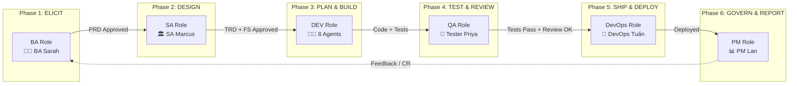

### Artifacts Flow giữa các Roles

```
BA:     elicit → PRD → wireframe → PRD sign-off
            ↓ (PRD Approved)
SA:     TRD → DDD technical model → Feature Spec → TRD sign-off
            ↓ (TRD + FS Approved)
DEV:    scout → plan → craft → test → review
            ↓ (Code + Tests Pass)
QA:     test spec → test cases → verification → bug report
            ↓ (QA Sign-off)
DevOps: build → deploy → monitor → incident response
            ↓ (Deployed)
PM:     charter → RAID/risk → status → lessons learned
```

---

## 3. Role 1: BA — Business Analyst

### 👤 Agent: BA Sarah (`business-analyst.md`)

> *"Senior Business Analyst, domain expert, user-centric, detail-oriented"*

### Sơ đồ hoạt động BA

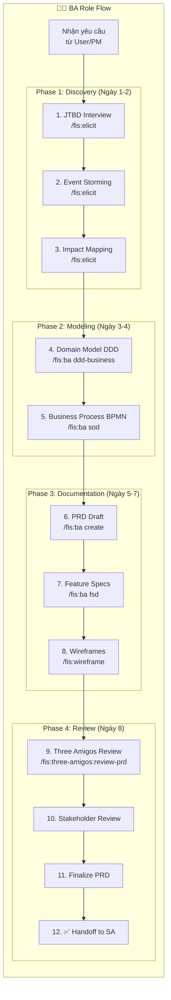

### BA — Chi tiết Components

#### 🤖 Agents sử dụng

| Agent | File | Vai trò trong BA |
|-------|------|-----------------|
| **business-analyst** | [business-analyst.md](file:///home/vietpv/Desktop/Agent-End-to-End/.claude/agents/business-analyst.md) | Primary — Thực hiện tất cả BA tasks |
| **brainstormer** | [brainstormer.md](file:///home/vietpv/Desktop/Agent-End-to-End/.claude/agents/brainstormer.md) | Support — Brainstorm giải pháp nghiệp vụ |
| **copywriter** | [copywriter.md](file:///home/vietpv/Desktop/Agent-End-to-End/.claude/agents/copywriter.md) | Support — Viết content PRD/user stories |

#### 🎯 Skills kích hoạt

| Skill | File | Mô tả hoạt động |
|-------|------|-----------------|
| `/fis:elicit` | [elicit.md](file:///home/vietpv/Desktop/Agent-End-to-End/.claude/skills/ba/elicit.md) | Phỏng vấn JTBD, Event Storming, Impact Mapping → extract personas, pain/gain points |
| `/fis:ba create` | [ba-create.md](file:///home/vietpv/Desktop/Agent-End-to-End/.claude/skills/ba/ba-create.md) | Tạo PRD mới từ notes → `artifacts/prd/PRD-NNNN.md` |
| `/fis:ba generate` | [ba-generate.md](file:///home/vietpv/Desktop/Agent-End-to-End/.claude/skills/ba/ba-generate.md) | Reverse-engineer PRD từ codebase (brownfield) |
| `/fis:ba ddd-business` | [ba-ddd-business.md](file:///home/vietpv/Desktop/Agent-End-to-End/.claude/skills/ba/ba-ddd-business.md) | Domain modeling: Bounded Contexts, Ubiquitous Language, Context Map |
| `/fis:ba sod` | [ba-sod.md](file:///home/vietpv/Desktop/Agent-End-to-End/.claude/skills/ba/ba-sod.md) | BPMN process flow + decision tables |
| `/fis:ba fsd` | [ba-fsd.md](file:///home/vietpv/Desktop/Agent-End-to-End/.claude/skills/ba/ba-fsd.md) | Functional Spec chi tiết cho từng module |
| `/fis:ba cr` | [ba-cr.md](file:///home/vietpv/Desktop/Agent-End-to-End/.claude/skills/ba/ba-cr.md) | Change Request management → `artifacts/change-requests/CR-NNNN.md` |
| `/fis:wireframe` | [wireframe.md](file:///home/vietpv/Desktop/Agent-End-to-End/.claude/skills/ba/wireframe.md) | Sketch UI flow cho main screens |
| `/fis:three-amigos:review-prd` | [three-amigos-review-prd.md](file:///home/vietpv/Desktop/Agent-End-to-End/.claude/skills/ba/three-amigos-review-prd.md) | BA + SA + QA sign-off PRD |
| `/fis:scenario` | cross-role | Sinh edge cases cho requirements (12 chiều) |
| `/fis:predict` | cross-role | 5 persona tranh luận chiến lược |

#### 📋 Workflows

| Workflow | File | Nội dung |
|----------|------|----------|
| **BA-1: Elicit Requirements** ⭐ | [01-elicit-requirements.md](file:///home/vietpv/Desktop/Agent-End-to-End/.claude/workflows/ba/01-elicit-requirements.md) | 12 bước: Discovery → Modeling → Documentation → Review |
| **BA-2/3/4: Feature/Docs/Multimodal** | [02-04-feature-docs-multimodal.md](file:///home/vietpv/Desktop/Agent-End-to-End/.claude/workflows/ba/02-04-feature-docs-multimodal.md) | PRD cho feature mới, docs alignment, multimodal assets |

#### 📏 Rules áp dụng

| Rule | Cách tác động |
|------|--------------|
| [team-coordination-rules.md](file:///home/vietpv/Desktop/Agent-End-to-End/.claude/rules/team-coordination-rules.md) | BA chỉ write `artifacts/prd/`, `artifacts/wireframes/` — read-only mọi thứ khác |
| [primary-workflow.md](file:///home/vietpv/Desktop/Agent-End-to-End/.claude/rules/primary-workflow.md) | Three Amigos trước Code: BA + SA + QA align |

#### 🪝 Hooks can thiệp

| Hook | Khi nào chạy | Tác động |
|------|-------------|----------|
| `privacy-block.cjs` | Pre-tool | Chặn BA đọc `.env`, secrets |
| `descriptive-name.cjs` | Pre-tool | Enforce tên file PRD descriptive |
| `session-init.cjs` | Session start | Detect project type, load BA context |

#### 📦 Output Artifacts

```
artifacts/prd/PRD-NNNN-<name>.md          ← PRD document
artifacts/feature-specs/FS-NNNN-<name>.md ← Feature Spec
artifacts/wireframes/                      ← UI wireframes
artifacts/change-requests/CR-NNNN.md       ← Change Requests
```

---

## 4. Role 2: SA — Solutions Architect

### 👤 Agent: SA Marcus (`solutions-architect.md`)

> *"Solutions Architect, cloud-native expert, scalability-first, security-aware"*

### Sơ đồ hoạt động SA

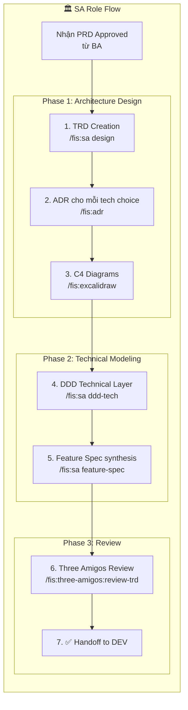

### SA — Chi tiết Components

#### 🤖 Agents sử dụng

| Agent | File | Vai trò trong SA |
|-------|------|-----------------|
| **solutions-architect** | [solutions-architect.md](file:///home/vietpv/Desktop/Agent-End-to-End/.claude/agents/solutions-architect.md) | Primary — Architecture design, TRD, ADR |
| **researcher** | [researcher.md](file:///home/vietpv/Desktop/Agent-End-to-End/.claude/agents/researcher.md) | Support — Nghiên cứu tech options, trade-off analysis |
| **security-auditor** | [security-auditor.md](file:///home/vietpv/Desktop/Agent-End-to-End/.claude/agents/security-auditor.md) | Support — Security review cho auth/payment decisions |

#### 🎯 Skills kích hoạt

| Skill | File | Mô tả hoạt động |
|-------|------|-----------------|
| `/fis:sa design` | [sa-design.md](file:///home/vietpv/Desktop/Agent-End-to-End/.claude/skills/sa/sa-design.md) | Tạo TRD: architecture, tech stack, API contract, NFR |
| `/fis:sa ddd-tech` | [sa-ddd-tech.md](file:///home/vietpv/Desktop/Agent-End-to-End/.claude/skills/sa/sa-ddd-tech.md) | DDD tech: data model, API mapping, sequence diagrams |
| `/fis:sa feature-spec` | [sa-feature-spec.md](file:///home/vietpv/Desktop/Agent-End-to-End/.claude/skills/sa/sa-feature-spec.md) | Synthesis FS từ TRD + DDD-tech → sẵn sàng cho DEV |
| `/fis:sa generate` | [sa-generate.md](file:///home/vietpv/Desktop/Agent-End-to-End/.claude/skills/sa/sa-generate.md) | Reverse-engineer TRD từ code (brownfield) |
| `/fis:sa review` | [sa-review.md](file:///home/vietpv/Desktop/Agent-End-to-End/.claude/skills/sa/sa-review.md) | Review code/PR với adversarial mindset |
| `/fis:adr` | [adr.md](file:///home/vietpv/Desktop/Agent-End-to-End/.claude/skills/dev/adr.md) | Architecture Decision Records |
| `/fis:three-amigos:review-trd` | [three-amigos-review-trd.md](file:///home/vietpv/Desktop/Agent-End-to-End/.claude/skills/sa/three-amigos-review-trd.md) | BA + SA + QA sign-off TRD |
| `/fis:code-review` | [code-review.md](file:///home/vietpv/Desktop/Agent-End-to-End/.claude/skills/sa/code-review.md) | Review PR — anti-pattern detection |
| `/fis:scout` | [scout.md](file:///home/vietpv/Desktop/Agent-End-to-End/.claude/skills/dev/scout.md) | Khám phá codebase, dependency mapping |
| `/fis:graphify` | cross-role | Knowledge graph cho architecture analysis |
| `/fis:gkg` | cross-role | GitLab Knowledge Graph — dependency analysis |

#### 📋 Workflows (10 SA Workflows)

| Workflow | Nội dung | Skills chính |
|----------|----------|-------------|
| **SA-1: Dự án mới** ⭐ | PRD → TRD → ADR → DDD-tech → FS → sign-off | `sa design`, `adr`, `sa ddd-tech`, `sa feature-spec` |
| **SA-2: Dự án hiện có** | Scout → GKG → reverse-engineer TRD | `scout`, `gkg`, `sa generate` |
| **SA-3: Thêm feature** | Review PRD → update TRD → FS → code review | `sa design`, `sa feature-spec`, `code-review` |
| **SA-4: Refactoring** | Review plan → approve arch changes → verify API compat | `scout`, `plan` |
| **SA-5: Auth** | Chọn auth approach → ADR → OWASP review → RBAC | `sa design`, `security` |
| **SA-6: REST API** | API contract design → review → load test | `backend-development`, `databases` |
| **SA-7: Payment** | Security review → ADR provider → webhook security | `security` |
| **SA-8: Documentation** | TRD, System Architecture, ADRs, C4 Diagrams | `docs`, `llms` |
| **SA-9: Bảo trì** | Tech debt assessment → modernization → security scan | `scout`, `fix`, `security-scan` |
| **SA-10: GKG Analysis** | Dependency graph → circular deps → coupling hotspots | `gkg`, `scout`, `graphify` |

All 10 workflows defined in: [01-10-all-workflows.md](file:///home/vietpv/Desktop/Agent-End-to-End/.claude/workflows/sa/01-10-all-workflows.md)

#### 📏 Rules áp dụng

| Rule | Cách tác động |
|------|--------------|
| [team-coordination-rules.md](file:///home/vietpv/Desktop/Agent-End-to-End/.claude/rules/team-coordination-rules.md) | SA chỉ write `artifacts/trd/`, `artifacts/decisions/`, `docs/system-architecture.md` |
| [dev-role-matrix.md](file:///home/vietpv/Desktop/Agent-End-to-End/.claude/rules/dev-role-matrix.md) | DEV escalate lên SA khi: architecture change, new dependency, security concern |
| [auto-inject-rules.md](file:///home/vietpv/Desktop/Agent-End-to-End/.claude/rules/auto-inject-rules.md) | Auto-inject `/fis:secure` trước plan khi intent = auth/payment |

#### 📦 Output Artifacts

```
artifacts/trd/TRD-NNNN-<name>.md       ← Technical Reference Document
artifacts/decisions/ADR-NNN-<name>.md   ← Architecture Decision Records
artifacts/feature-specs/FS-NNNN.md      ← Feature Spec (for DEV)
docs/system-architecture.md             ← System Architecture doc
```

---

## 5. Role 3: DEV — Development

### 👤 Agent: DEV Orchestrator + 8 Sub-agents

> *"DEV Orchestrator là bộ não trung tâm — user chỉ cần nói tự nhiên"*

### Sơ đồ hoạt động DEV

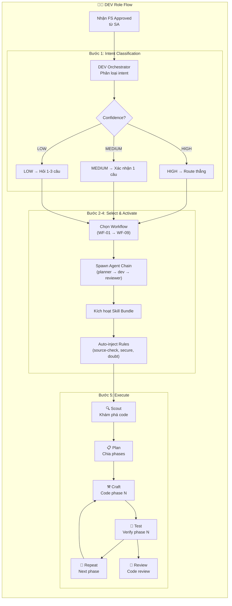

### DEV — Chi tiết Components

#### 🤖 Agents sử dụng (8 agents + 1 orchestrator)

| Agent | File | Vai trò | Khi nào spawn |
|-------|------|---------|--------------|
| **dev-orchestrator** | [dev-orchestrator.md](file:///home/vietpv/Desktop/Agent-End-to-End/.claude/agents/dev-orchestrator.md) | 🧠 Bộ não trung tâm — phân loại intent, chọn workflow, spawn agents | **MẶC ĐỊNH** — entry point |
| **planner** | [planner.md](file:///home/vietpv/Desktop/Agent-End-to-End/.claude/agents/planner.md) | Lên kế hoạch implementation, chia phases | `add_feature`, `new_project`, `refactor` |
| **fullstack-developer** | [fullstack-developer.md](file:///home/vietpv/Desktop/Agent-End-to-End/.claude/agents/fullstack-developer.md) | Code frontend + backend | `add_feature`, `auth`, `payment`, `bug_fix` |
| **debugger** | [debugger.md](file:///home/vietpv/Desktop/Agent-End-to-End/.claude/agents/debugger.md) | Debug root cause, log analysis | `bug_fix` |
| **code-reviewer** | [code-reviewer.md](file:///home/vietpv/Desktop/Agent-End-to-End/.claude/agents/code-reviewer.md) | Review PR, detect anti-patterns | Sau `craft`, trước `ship` |
| **code-simplifier** | [code-simplifier.md](file:///home/vietpv/Desktop/Agent-End-to-End/.claude/agents/code-simplifier.md) | Refactor, giảm complexity | `refactor` |
| **database-admin** | [database-admin.md](file:///home/vietpv/Desktop/Agent-End-to-End/.claude/agents/database-admin.md) | Schema, migration, query optimization | `database` |
| **ui-ux-designer** | [ui-ux-designer.md](file:///home/vietpv/Desktop/Agent-End-to-End/.claude/agents/ui-ux-designer.md) | Design system, components, responsive | `frontend_ui` |
| **researcher** | [researcher.md](file:///home/vietpv/Desktop/Agent-End-to-End/.claude/agents/researcher.md) | Research spike, POC, evaluate | `onboarding`, `research_spike` |

#### Agent Chains (thứ tự spawn theo intent)

```
onboarding:     researcher → planner
add_feature:    planner → fullstack-developer → code-reviewer
bug_fix:        debugger → fullstack-developer → code-reviewer
refactor:       planner → code-simplifier → code-reviewer
auth:           planner → fullstack-developer → tester-qa
payment:        planner → fullstack-developer → tester-qa
database:       database-admin → fullstack-developer
frontend_ui:    ui-ux-designer → fullstack-developer
new_project:    planner → fullstack-developer
devops:         devops-sre (single)
code_review:    code-reviewer (single)
```

#### 🎯 Skills kích hoạt (29 DEV skills)

| Skill | File | Mô tả hoạt động |
|-------|------|-----------------|
| `/fis:scout` | [scout.md](file:///home/vietpv/Desktop/Agent-End-to-End/.claude/skills/dev/scout.md) | Khám phá codebase — tổng quan, patterns, dependencies |
| `/fis:plan` | [plan.md](file:///home/vietpv/Desktop/Agent-End-to-End/.claude/skills/dev/plan.md) | Tạo implementation plan — chia phases, tasks |
| `/fis:craft` | [craft.md](file:///home/vietpv/Desktop/Agent-End-to-End/.claude/skills/dev/craft.md) | Code theo plan — phase by phase |
| `/fis:test` | [test.md](file:///home/vietpv/Desktop/Agent-End-to-End/.claude/skills/dev/test.md) | Chạy test suite, coverage analysis |
| `/fis:fix` | [fix.md](file:///home/vietpv/Desktop/Agent-End-to-End/.claude/skills/dev/fix.md) | Sửa lỗi tự động |
| `/fis:simplify` | [simplify.md](file:///home/vietpv/Desktop/Agent-End-to-End/.claude/skills/dev/simplify.md) | Refactor — giảm complexity |
| `/fis:doubt` | [doubt.md](file:///home/vietpv/Desktop/Agent-End-to-End/.claude/skills/dev/doubt.md) | Adversarial review — challenge assumptions |
| `/fis:source-check` | [source-check.md](file:///home/vietpv/Desktop/Agent-End-to-End/.claude/skills/dev/source-check.md) | Verify official docs trước khi dùng framework |
| `/fis:observe` | [observe.md](file:///home/vietpv/Desktop/Agent-End-to-End/.claude/skills/dev/observe.md) | Monitoring, logging, tracing, observability |
| `/fis:cook` | [implementation-bundle.md](file:///home/vietpv/Desktop/Agent-End-to-End/.claude/skills/dev/implementation-bundle.md) | Full implementation engine: research → plan → implement → test → review |
| `/fis:ship-bootstrap` | [ship-bootstrap.md](file:///home/vietpv/Desktop/Agent-End-to-End/.claude/skills/dev/ship-bootstrap.md) | Bootstrap project scaffold |
| `/fis:backend-development` | [backend-development.md](file:///home/vietpv/Desktop/Agent-End-to-End/.claude/skills/dev/backend-development.md) | REST API, GraphQL, gRPC patterns |
| `/fis:frontend-development` | [frontend-development.md](file:///home/vietpv/Desktop/Agent-End-to-End/.claude/skills/dev/frontend-development.md) | React/Vue/Next.js components |
| `/fis:databases` | [databases.md](file:///home/vietpv/Desktop/Agent-End-to-End/.claude/skills/dev/databases.md) | Schema, migration, query optimization |
| `/fis:security-hardening` | [security-hardening.md](file:///home/vietpv/Desktop/Agent-End-to-End/.claude/skills/dev/security-hardening.md) | OWASP, input validation, rate limiting |
| `/fis:git-discipline` | [git-discipline.md](file:///home/vietpv/Desktop/Agent-End-to-End/.claude/skills/dev/git-discipline.md) | Commit convention, branch strategy |

Full skill index: [00-index.md](file:///home/vietpv/Desktop/Agent-End-to-End/.claude/skills/dev/00-index.md)

#### 📋 Workflows (7 DEV Workflows)

| # | Workflow | File | Pattern |
|---|----------|------|---------|
| WF-01 | New Project | [01-new-project.md](file:///home/vietpv/Desktop/Agent-End-to-End/.claude/workflows/dev/01-new-project.md) | `bootstrap → plan → craft × N → test → ship` |
| WF-02 | Existing Project | [02-existing-project.md](file:///home/vietpv/Desktop/Agent-End-to-End/.claude/workflows/dev/02-existing-project.md) | `scout → gkg → graphify → research → plan` |
| WF-03 | Adding Feature ⭐ | [03-adding-feature.md](file:///home/vietpv/Desktop/Agent-End-to-End/.claude/workflows/dev/03-adding-feature.md) | `scout → plan → craft → test → fix → review → ship` |
| WF-04 | Auth | [04-implementing-auth.md](file:///home/vietpv/Desktop/Agent-End-to-End/.claude/workflows/dev/04-implementing-auth.md) | `security → plan → craft → test → review` |
| WF-05 | Payment | [05-payment-integration.md](file:///home/vietpv/Desktop/Agent-End-to-End/.claude/workflows/dev/05-payment-integration.md) | `security → plan → craft → test → review` |
| WF-06 | Bug Fix | [06-fixing-bugs.md](file:///home/vietpv/Desktop/Agent-End-to-End/.claude/workflows/dev/06-fixing-bugs.md) | `debug → fix → test → review → ship` |
| WF-07 | Refactoring | [07-refactoring-code.md](file:///home/vietpv/Desktop/Agent-End-to-End/.claude/workflows/dev/07-refactoring-code.md) | `scout → plan → test(baseline) → craft → test(verify) → review` |

Workflow index: [00-index.md](file:///home/vietpv/Desktop/Agent-End-to-End/.claude/workflows/dev/00-index.md)

#### 📏 Rules áp dụng cho DEV

| Rule | File | Cách tác động |
|------|------|--------------|
| **Natural Language Routing** | [natural-language-dev-routing.md](file:///home/vietpv/Desktop/Agent-End-to-End/.claude/rules/natural-language-dev-routing.md) | Map tiếng Việt/English → intent → workflow → agents |
| **Dev Role Matrix** | [dev-role-matrix.md](file:///home/vietpv/Desktop/Agent-End-to-End/.claude/rules/dev-role-matrix.md) | Bảng phân quyền: intent → agents → skills → output |
| **Skill Workflow Routing** | [skill-workflow-routing.md](file:///home/vietpv/Desktop/Agent-End-to-End/.claude/rules/skill-workflow-routing.md) | Thứ tự skill execution + 5 routing rules |
| **Skill Domain Routing** | [skill-domain-routing.md](file:///home/vietpv/Desktop/Agent-End-to-End/.claude/rules/skill-domain-routing.md) | Decision tree chọn skill theo domain (Frontend/Backend/AI/DevOps...) |
| **Auto-inject Rules** | [auto-inject-rules.md](file:///home/vietpv/Desktop/Agent-End-to-End/.claude/rules/auto-inject-rules.md) | Tự động inject: `source-check`, `secure`, `doubt`, `security-scan` |
| **Development Rules** | [development-rules.md](file:///home/vietpv/Desktop/Agent-End-to-End/.claude/rules/development-rules.md) | PEP 8, type hints, max 50 LOC/function, max 300 LOC/file |
| **Engineering Discipline** | [engineering-discipline.md](file:///home/vietpv/Desktop/Agent-End-to-End/.claude/rules/engineering-discipline.md) | Quality gates, testing requirements |
| **Orchestration Protocol** | [orchestration-protocol.md](file:///home/vietpv/Desktop/Agent-End-to-End/.claude/rules/orchestration-protocol.md) | Delegation context, status protocol, handoff format |

#### 🪝 Hooks can thiệp DEV

| Hook | Loại | Tác động lên DEV |
|------|------|-----------------|
| `privacy-block.cjs` | Pre-tool | ❌ Chặn đọc `.env`, secrets, API keys |
| `scout-block.cjs` | Pre-tool | ❌ Chặn đọc `node_modules/`, `dist/`, `.next/` |
| `descriptive-name.cjs` | Pre-tool | Enforce tên file descriptive khi tạo mới |
| `cook-after-plan-reminder.cjs` | Session | Nhắc craft sau khi plan xong |
| `simplify-gate.cjs` | User input | ⚠️ Warn khi diff > 200 LOC, chưa refactor |
| `dev-rules-reminder.cjs` | User input | Inject dev rules vào prompt context |
| `plan-format-kanban.cjs` | Post-tool | Validate plan.md format |
| `session-state.cjs` | Post-tool | Lưu/restore progress giữa sessions |

#### 📦 Output Artifacts

```
src/                          ← Source code
tests/                        ← Test files
plans/<date>-<feature>/       ← Implementation plans
  plan.md
  phase-1.md, phase-2.md...
```

---

## 6. Role 4: QA — Quality Assurance

### 👤 Agent: Tester Priya (`tester.md`)

> *"QA Lead, automation specialist, risk-based testing, shift-left mindset"*

### Sơ đồ hoạt động QA

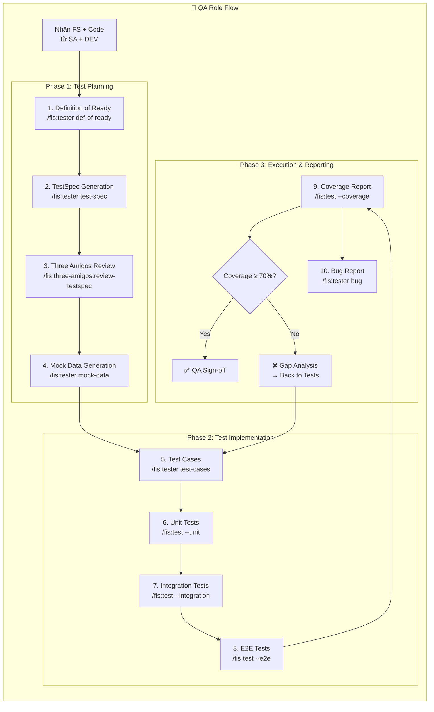

### QA — Chi tiết Components

#### 🤖 Agents sử dụng

| Agent | File | Vai trò |
|-------|------|---------|
| **tester** | [tester.md](file:///home/vietpv/Desktop/Agent-End-to-End/.claude/agents/tester.md) | Primary — Test planning, execution, bug reporting |

#### 🎯 Skills kích hoạt

| Skill | File | Mô tả hoạt động |
|-------|------|-----------------|
| `/fis:tester test-spec` | [tester-test-spec.md](file:///home/vietpv/Desktop/Agent-End-to-End/.claude/skills/qa/tester-test-spec.md) | Sinh TestSpec từ AC × test matrix → `TESTSPEC-NNNN.md` |
| `/fis:tester test-cases` | [tester-test-cases.md](file:///home/vietpv/Desktop/Agent-End-to-End/.claude/skills/qa/tester-test-cases.md) | Sinh test scenarios (.py test files) |
| `/fis:tester bug` | [tester-bug.md](file:///home/vietpv/Desktop/Agent-End-to-End/.claude/skills/qa/tester-bug.md) | Formal bug report: `BG-NNNN.md` với reproduce steps |
| `/fis:tester mock-data` | [tester-mock-data.md](file:///home/vietpv/Desktop/Agent-End-to-End/.claude/skills/qa/tester-mock-data.md) | Sinh fixtures + factories cho testing |
| `/fis:tester def-of-ready` | [tester-def-of-ready.md](file:///home/vietpv/Desktop/Agent-End-to-End/.claude/skills/qa/tester-def-of-ready.md) | Kiểm tra FS testable TRƯỚC khi plan test |
| `/fis:test` | [test.md](file:///home/vietpv/Desktop/Agent-End-to-End/.claude/skills/qa/test.md) | Chạy test suite (unit/integration/e2e/coverage) |
| `/fis:three-amigos:review-testspec` | [three-amigos-review-testspec.md](file:///home/vietpv/Desktop/Agent-End-to-End/.claude/skills/qa/three-amigos-review-testspec.md) | BA + SA + QA sign-off TestSpec |
| `/fis:scenario` | cross-role | Sinh edge cases theo 12 chiều |
| `/fis:agent-browser` | [agent-browser.md](file:///home/vietpv/Desktop/Agent-End-to-End/.claude/skills/ai-tools/agent-browser.md) | Browser automation cho UI/E2E testing |

#### 📋 Workflows (6 QA Workflows)

| # | Workflow | Nội dung |
|---|----------|----------|
| QA-1 | Chiến lược kiểm thử ⭐ | TestSpec → mock data → test automation → bug triage → regression |
| QA-2 | Feature mới (QA view) | PRD → TRD → def-of-ready → TestSpec → Three Amigos → verify → sign-off |
| QA-3 | Sửa lỗi (QA view) | Verify reproduce → BG report → re-test → regression → sign-off |
| QA-4 | Auth Testing | 3 roles × 5 actions × 3 states = 45 test cases + security tests |
| QA-5 | API Testing | Contract test + load test (k6) + OWASP API Top 10 |
| QA-6 | Payment Testing | E2E sandbox + webhook replay + idempotency + edge cases |

All workflows: [01-06-all-workflows.md](file:///home/vietpv/Desktop/Agent-End-to-End/.claude/workflows/qa/01-06-all-workflows.md)

#### Test Strategy Pyramid

```
        /  E2E  \          ← 10% — Ít nhất, chậm nhất
       /  (10%)  \
      /───────────\
     / Integration \       ← 30% — Vừa phải
    /    (30%)      \
   /─────────────────\
  /    Unit Tests     \    ← 60% — Nhiều nhất, nhanh nhất
 /      (60%)          \
/───────────────────────\
```

#### 📦 Output Artifacts

```
artifacts/test-specs/TESTSPEC-NNNN.md  ← Test Specification
tests/                                 ← Test files (unit, integration, e2e)
tests/fixtures/                        ← Mock data fixtures
tests/factories/                       ← Test factories
artifacts/bugs/BG-NNNN.md             ← Formal bug reports
```

---

## 7. Role 5: DevOps — SRE

### 👤 Agent: DevOps Tuấn (`devops-sre.md`)

> *"SRE, reliability-first, automate-everything mindset"*

### Sơ đồ hoạt động DevOps

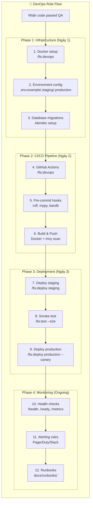

### DevOps — Chi tiết Components

#### 🤖 Agents sử dụng

| Agent | File | Vai trò |
|-------|------|---------|
| **devops-sre** | [devops-sre.md](file:///home/vietpv/Desktop/Agent-End-to-End/.claude/agents/devops-sre.md) | Primary — IaC, CI/CD, deployment, monitoring |

#### 🎯 Skills kích hoạt

| Skill | File | Mô tả hoạt động |
|-------|------|-----------------|
| `/fis:devops` | [devops.md](file:///home/vietpv/Desktop/Agent-End-to-End/.claude/skills/devops/devops.md) | Docker, Compose, K8s, CI/CD patterns |
| `/fis:deploy` | [deploy.md](file:///home/vietpv/Desktop/Agent-End-to-End/.claude/skills/devops/deploy.md) | Deploy staging → canary → production |
| `/fis:debug` | [debug.md](file:///home/vietpv/Desktop/Agent-End-to-End/.claude/skills/devops/debug.md) | Log analysis, root cause investigation |
| `/fis:security-scan` | [security-bundle.md](file:///home/vietpv/Desktop/Agent-End-to-End/.claude/skills/devops/security-bundle.md) | OWASP, dependency CVE audit, trivy |
| `/fis:fix-auto` | [fix-auto.md](file:///home/vietpv/Desktop/Agent-End-to-End/.claude/skills/devops/fix-auto.md) | Auto-fix deployment/infra issues |
| `/fis:git-worktree` | [git-worktree.md](file:///home/vietpv/Desktop/Agent-End-to-End/.claude/skills/devops/git-worktree.md) | Git worktree cho parallel development |

#### 📋 Workflows (4 DevOps Workflows)

| # | Workflow | Nội dung | Skills |
|---|----------|----------|--------|
| DevOps-1 | CI/CD, Deploy & Monitoring ⭐ | 12 bước: Docker → CI/CD → Deploy → Monitor | `devops`, `deploy`, `debug`, `security-scan` |
| DevOps-2 | Sửa lỗi infra | Detect → diagnose → mitigate → fix → postmortem | `debug`, `fix-auto` |
| DevOps-3 | Tối ưu hiệu năng | Profile → benchmark → optimize → load test | `debug`, monitoring tools |
| DevOps-4 | Bảo trì dự án cũ | Vulnerability scan → patch → cert renewal → backup | `scout`, `fix`, `security-scan` |

All workflows: [devops-role-workflows.md](file:///home/vietpv/Desktop/Agent-End-to-End/.claude/workflows/devops/devops-role-workflows.md)

#### Canary Deployment Strategy

```
5% traffic → monitor 30min → 25% → monitor 30min → 100%

Rollback triggers:
- Error rate > 2% trong 5 phút
- Response time p95 > 1s
- Container restart > 3 trong 10 phút
```

#### 📦 Output Artifacts

```
Dockerfile, docker-compose.yml          ← Infrastructure as Code
.github/workflows/ci.yml                ← CI/CD pipeline
docs/runbooks/RUNBOOK-NNN-<name>.md     ← Incident runbooks
docs/postmortems/<date>-<incident>.md   ← Incident postmortems
```

---

## 8. Role 6: PM — Project Manager

### 👤 Agent: PM Lan (`project-manager.md`)

> *"Senior Project Manager, PMP-certified, 10+ năm kinh nghiệm"*

### Sơ đồ hoạt động PM

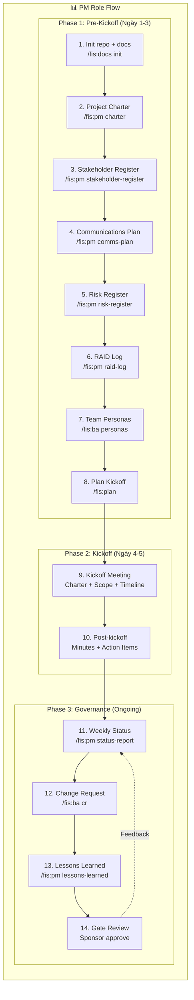

### PM — Chi tiết Components

#### 🤖 Agents sử dụng

| Agent | File | Vai trò |
|-------|------|---------|
| **project-manager** | [project-manager.md](file:///home/vietpv/Desktop/Agent-End-to-End/.claude/agents/project-manager.md) | Primary — Governance, status, risk management |
| **journal-writer** | [journal-writer.md](file:///home/vietpv/Desktop/Agent-End-to-End/.claude/agents/journal-writer.md) | Support — Session journal, audit trail |

#### 🎯 Skills kích hoạt

| Skill | File | Mô tả hoạt động |
|-------|------|-----------------|
| `/fis:pm` | [pm.md](file:///home/vietpv/Desktop/Agent-End-to-End/.claude/skills/pm/pm.md) | PM workflows: charter, status-report, lessons-learned, retro |
| `/fis:plan` | [plan.md](file:///home/vietpv/Desktop/Agent-End-to-End/.claude/skills/pm/plan.md) | Tạo đầu việc, plan cho agents |
| `/fis:project-management` | [project-management.md](file:///home/vietpv/Desktop/Agent-End-to-End/.claude/skills/pm/project-management.md) | Sprint planning, backlog grooming |
| `/fis:kanban-mintlify` | [kanban-mintlify.md](file:///home/vietpv/Desktop/Agent-End-to-End/.claude/skills/pm/kanban-mintlify.md) | Kanban board management |
| `/fis:personas` | [personas.md](file:///home/vietpv/Desktop/Agent-End-to-End/.claude/skills/pm/personas.md) | Team persona profiles |
| `/fis:project-session-extended` | [project-session-extended.md](file:///home/vietpv/Desktop/Agent-End-to-End/.claude/skills/pm/project-session-extended.md) | Extended session management |
| `/fis:scenario` | cross-role | Sinh risk scenarios |
| `/fis:mermaidjs-v11` | cross-role | Vẽ gantt chart, timeline |
| `/fis:copywriting` | cross-role | Viết status report, stakeholder comms |

#### 📋 Workflows

| # | Workflow | File | Nội dung |
|---|----------|------|----------|
| PM-1 | Kickoff & Governance ⭐ | [01-kickoff-governance.md](file:///home/vietpv/Desktop/Agent-End-to-End/.claude/workflows/pm/01-kickoff-governance.md) | 14 bước: Pre-Kickoff → Kickoff → Governance |
| PM-2/3 | New Project Docs | [02-03-new-project-docs.md](file:///home/vietpv/Desktop/Agent-End-to-End/.claude/workflows/pm/02-03-new-project-docs.md) | Project docs alignment |

#### PM Cadence

| Tần suất | Hoạt động | Skill |
|----------|-----------|-------|
| **Hàng ngày** | Standup 15 phút, review RAID | Manual |
| **Hàng tuần** | Mon: re-plan, Wed: risk review, Fri: status | `/fis:pm status-report` |
| **Hàng tháng** | Stakeholder refresh, budget check, lessons | `/fis:pm lessons-learned` |
| **Cuối phase** | Gate review + retro | `/fis:pm retro` |

#### 📦 Output Artifacts

```
artifacts/pm/PROJECT-CHARTER.md          ← Project Charter (signed)
artifacts/pm/STAKEHOLDER-REGISTER.md     ← Stakeholder Register
artifacts/pm/COMMS-PLAN.md               ← Communications Plan
artifacts/pm/RISK-REGISTER.md            ← Risk Register
artifacts/pm/RAID-LOG.md                 ← RAID Log (live)
artifacts/pm/status-{date}.md            ← Weekly Status (RAG)
artifacts/pm/LESSONS-{phase}.md          ← Lessons Learned
artifacts/pm/retro-{date}.md             ← Sprint Retrospective
```

---

## 9. Hooks Lifecycle

### Tổng quan 16 Hooks

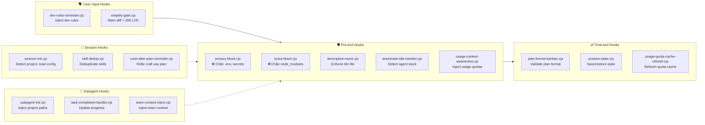

### Hook Execution Order

```
1. User gõ prompt
   └── [User Input Hooks] → dev-rules-reminder → simplify-gate
       └── Agent phân tích prompt
           └── [Session Hooks] → session-init → skill-dedup → cook-after-plan-reminder
               └── Agent quyết định dùng tool
                   └── [Pre-tool Hooks] → privacy-block → scout-block → descriptive-name
                       └── Agent thực hiện tool (Read/Write/Bash)
                           └── [Post-tool Hooks] → plan-format-kanban → session-state → quota-refresh
                               └── Kết quả trả user
                                   └── [Subagent Hooks] (nếu spawn) → subagent-init → team-context-inject
```

### Chi tiết hoạt động từng Hook

| # | Hook | Exit Code | Hoạt động chi tiết |
|---|------|-----------|--------------------|
| 1 | `privacy-block.cjs` | 0/2 | Kiểm tra path chứa `.env`, `secret`, `key`, `credential` → exit 2 (BLOCK) nếu match → yêu cầu user explicit approve |
| 2 | `scout-block.cjs` | 0/2 | Kiểm tra path match patterns trong `.ckignore` (`node_modules/`, `dist/`, `.next/`) → exit 2 (BLOCK) |
| 3 | `descriptive-name.cjs` | 0 | Regex check filename mới → warn nếu generic (temp, test1, untitled) |
| 4 | `session-init.cjs` | 0 | Detect `package.json`/`requirements.txt` → set project type → load role config |
| 5 | `simplify-gate.cjs` | 0 | Đếm LOC diff → warn nếu > 200 LOC chưa qua `/fis:simplify` |
| 6 | `plan-format-kanban.cjs` | 0 | Parse plan.md → warn nếu dùng filename thay human-readable title |
| 7 | `session-state.cjs` | 0 | JSON serialize session progress → persist → restore on next session |
| 8 | `subagent-init.cjs` | 0 | Inject `project_root`, `plan_path`, `agent_instructions` vào subagent context |
| 9 | `cook-after-plan-reminder.cjs` | 0 | Detect plan.md created → remind: "Plan done! Run `/fis:craft` to start coding" |
| 10 | `skill-dedup.cjs` | 0 | Track loaded skills → skip nếu đã load trong session |

---

## 10. Rules Engine

### Routing Flow chi tiết

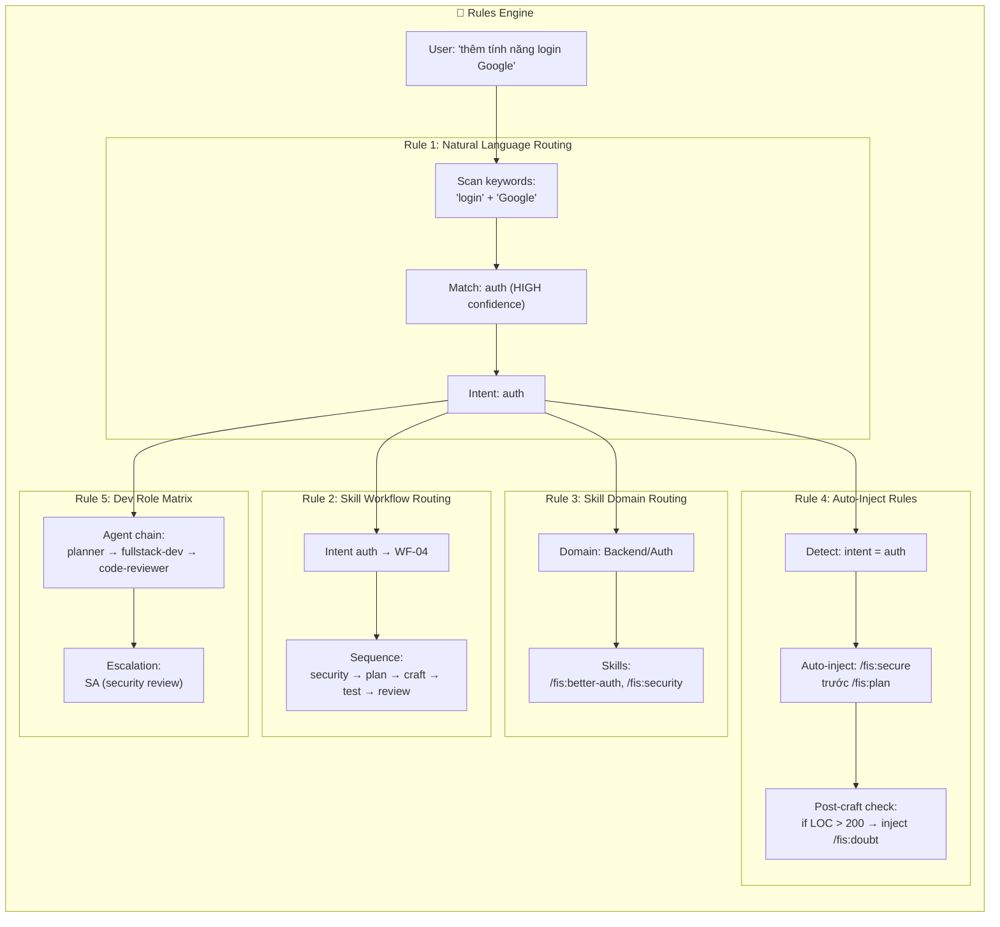

### 5 Routing Rules (Skill Workflow Routing)

| # | Rule | Nội dung | Ví dụ |
|---|------|----------|-------|
| 1 | **Plan Before Craft** | PHẢI có plan trước khi code (trừ fix < 10 LOC) | ❌ `craft "implement X"` → ✅ `plan "X"` → `craft "phase 1"` |
| 2 | **Test After Every Craft** | PHẢI test sau mỗi phase, không gộp | ❌ `craft 1` → `craft 2` → `test` → ✅ `craft 1` → `test` → `craft 2` → `test` |
| 3 | **Scout Before Craft** | PHẢI scout codebase trước khi code (existing project) | ❌ `craft "add feature"` → ✅ `scout` → `plan` → `craft` |
| 4 | **Review Before Ship** | PHẢI review trước khi ship | ❌ `craft` → `ship` → ✅ `craft` → `test` → `review` → `ship` |
| 5 | **Security for Auth/Payment** | PHẢI audit security cho auth/payment features | ❌ `craft "implement auth"` → ✅ `security` → `plan` → `craft` → `security verify` |

### Auto-Inject Conditions

| Condition | Auto-inject Skill | Insert Position |
|-----------|-------------------|----------------|
| Prompt chứa framework keyword (React, FastAPI, LangGraph...) | `/fis:source-check` | Trước `/fis:craft` |
| Intent = auth / payment | `/fis:secure` | Trước `/fis:plan` |
| Changes > 200 LOC (non-mechanical) | `/fis:doubt` | Sau `/fis:craft`, trước `/fis:code-review` |
| Intent = deploy / ship | `/fis:security-scan` | Trước `/fis:deploy` |
| Intent = agentize / MCP | `/fis:context-engineering` | Trước `/fis:agentize` |
| Codebase > 500 files + research intent | `/fis:repomix` | Trước `/fis:scout` |

---

## 11. Handoff & Escalation

### Handoff Protocol giữa các Roles

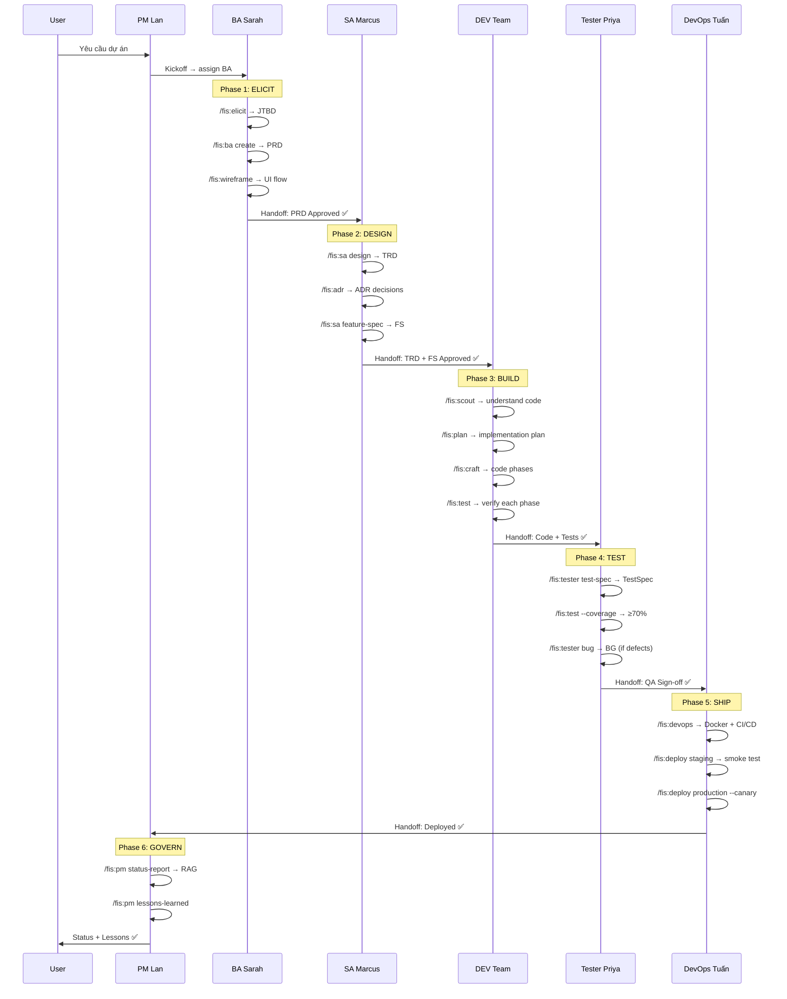

### Handoff Format (bắt buộc)

```markdown
## Handoff: [Agent A] → [Agent B]

### Đã hoàn thành
- [x] Task 1: <description>
- [x] Task 2: <description>

### Files changed
- `path/to/file1.py` — Added service layer
- `path/to/file2.py` — Updated schema

### Cho Agent B
- [ ] Task tiếp theo: <description>
- [ ] Constraints: <any limits>
- [ ] References: <links to docs/specs>
```

### Escalation Rules

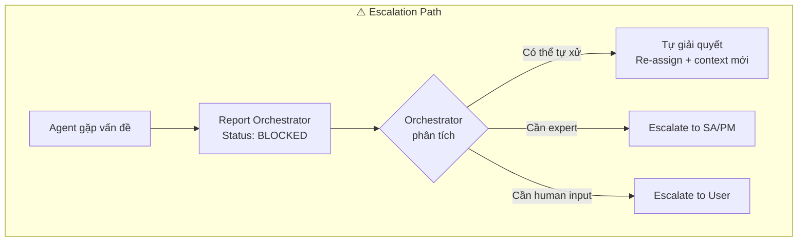

| Khi nào escalate | Escalate cho ai |
|------------------|-----------------|
| Architecture change (thay đổi module/service) | SA |
| New dependency (thêm library/framework) | SA |
| Security concern (auth, payment, PII) | SA + Security Auditor |
| Breaking change (API contract thay đổi) | SA + PM |
| Scope creep (task > 4 hours) | PM |
| Requirements conflict với PRD/TRD | PM + BA |
| Role cần write ngoài ownership boundary | Orchestrator |
| Baseline tests fail trước change | User |
| Bug không reproduce được | User |

---

## 📊 Tổng Hợp — Ma Trận Role × Components

| Role | Agents | Skills | Workflows | Rules Áp Dụng | Hooks Can Thiệp | Artifacts Output |
|------|--------|--------|-----------|---------------|-----------------|-----------------|
| **BA** | 3 (analyst, brainstormer, copywriter) | 11 skills | 2-4 workflows | team-coord, primary-workflow | privacy-block, descriptive-name, session-init | PRD, FS, Wireframes, CR |
| **SA** | 3 (architect, researcher, security-auditor) | 12 skills | 10 workflows | team-coord, dev-role-matrix, auto-inject | privacy-block, session-init | TRD, ADR, FS, System Arch |
| **DEV** | 9 (orchestrator + 8 sub-agents) | 29+ skills | 7 workflows | NL-routing, dev-matrix, skill-routing, domain-routing, auto-inject, dev-rules, engineering-discipline, orchestration-protocol | ALL 16 hooks | src/, tests/, plans/ |
| **QA** | 1 (tester) | 9 skills | 6 workflows | team-coord, primary-workflow | privacy-block, session-init | TestSpecs, Tests, BG reports |
| **DevOps** | 1 (devops-sre) | 6 skills | 4 workflows | team-coord, auto-inject | privacy-block, scout-block | Dockerfile, CI/CD, Runbooks |
| **PM** | 2 (manager, journal-writer) | 9 skills | 2-3 workflows | team-coord, primary-workflow | session-init, session-state | Charter, RAID, Status, Lessons |

> [!TIP]
> **DEV Role** là phức tạp nhất với 9 agents, 29+ skills, 7 workflows, 8 rules, và tất cả 16 hooks đều can thiệp. Đây là lý do DEV Orchestrator tồn tại — để quản lý complexity này.
